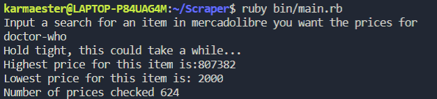
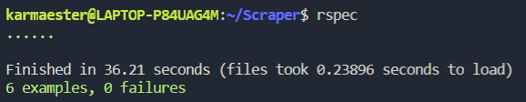

# Scraper

> This Scraper gives you an array with all of the articles prices resulting from a search in www.mercadolibre.com

## Built With

- Ruby
- Nokogiri
- open-URI
- Byebug

## Getting Started

**This program lets you get an array of the prices from all articles resulting in a www.mercadolibre.com search.**


To get a local copy up and running follow these simple example steps.

- Go to the repository main page.

- Press the "Code" button and copy the repo link.

- Clone it in you local machine using git command "git clone <link>".

### Prerequisites

Ruby language

gems:

- Nokogiri
- Open-URI

### Usage

Install dependencies using:

```ruby
bundle install
```

Launch the program with the command

```ruby
ruby bin/main.rb 
```

You will be asked to input a search for an item in mercadolibre you want the prices for.

Some valid and not too long-results inputs are:

 doctor-who
 
 buzz

The program will iterate through the result pages and output the page that is checking at the moment.


Finally it will output the array with all of the prices for this result.



### Run tests

Tested with Rspec


## Authors

👤 **karmaester**

- Github: [@githubhandle](https://github.com/karmaester)
- Twitter: [@twitterhandle](https://twitter.com/karmaendlich)
- Linkedin: [linkedin](https://www.linkedin.com/in/khristian-rojas/)

## 🤝 Contributing

Contributions, issues, and feature requests are welcome!

Feel free to check the [issues page](https://github.com/karmaester/Scraper/issues).

## Show your support

Give a ⭐️ if you like this project!

## Acknowledgments

Microverse capstone

Nokogiri.org

## 📝 License

This project is [MIT](https://github.com/karmaester/Scraper/blob/development/LICENSE) licensed.
