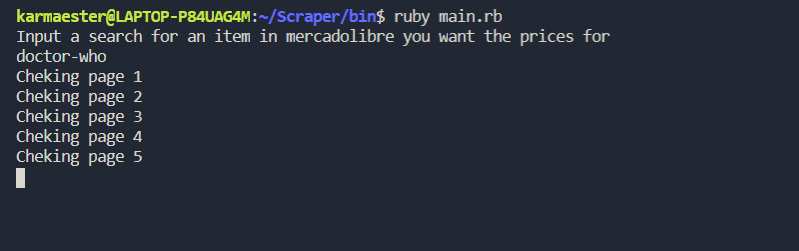
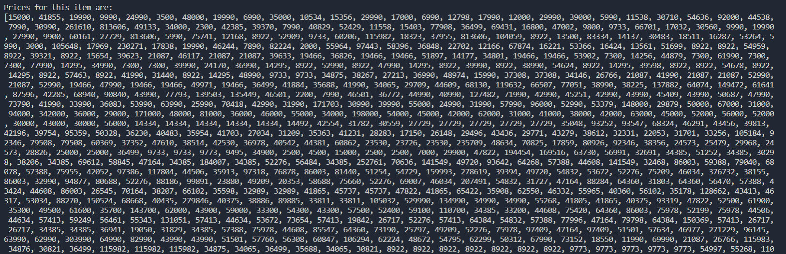
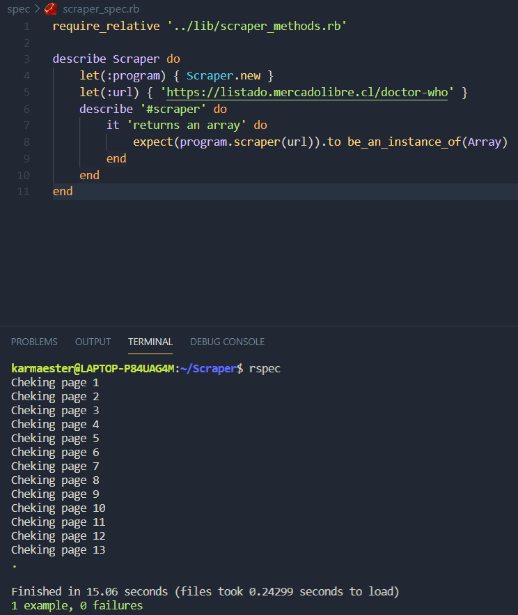

# Scraper

> This Scraper gives you an array with all of the articles prices resulting from a search in www.mercadolibre.com

## Built With

- Ruby
- Nokogiri
- open-URI
- Byebug

## Getting Started

**This program lets you get an array of the prices from all articles resulting in a www.mercadolibre.com search. **

To get a local copy up and running follow these simple example steps.

### Prerequisites

Ruby language

gems:

- Nokogiri
- Open-URI
- Byebug

### Usage

Launch the program with the command ruby main.rb

You will be asked to input a search for an item in mercadolibre you want the prices for.

Some valid and not too long-results inputs are:

 doctor-who
 buzz

The program will iterate through the result pages and output the page that is checking at the moment.

Finally it will output the array with all of the prices for this result.

### Run tests

Tested with Rspec

## Authors

👤 **karmaester**

- Github: [@githubhandle](https://github.com/karmaester)
- Twitter: [@twitterhandle](https://twitter.com/karmaendlich)
- Linkedin: [linkedin](https://www.linkedin.com/in/khristian-rojas/)

## 🤝 Contributing

Contributions, issues, and feature requests are welcome!

Feel free to check the [issues page](https://github.com/karmaester/Scraper/issues).

## Show your support

Give a ⭐️ if you like this project!

## Acknowledgments

Microverse capstone
Nokogiri.org

## 📝 License

This project is [MIT](https://github.com/karmaester/Scraper/blob/development/LICENSE) licensed.
